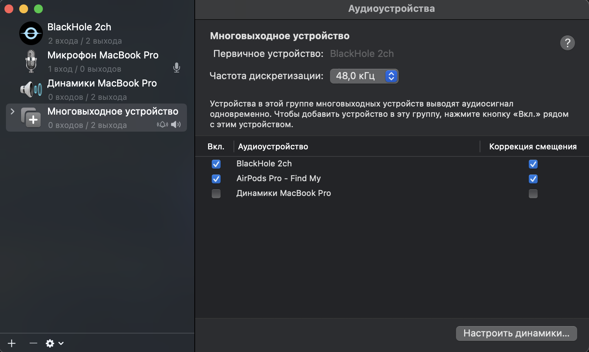
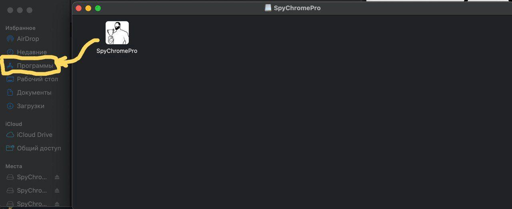
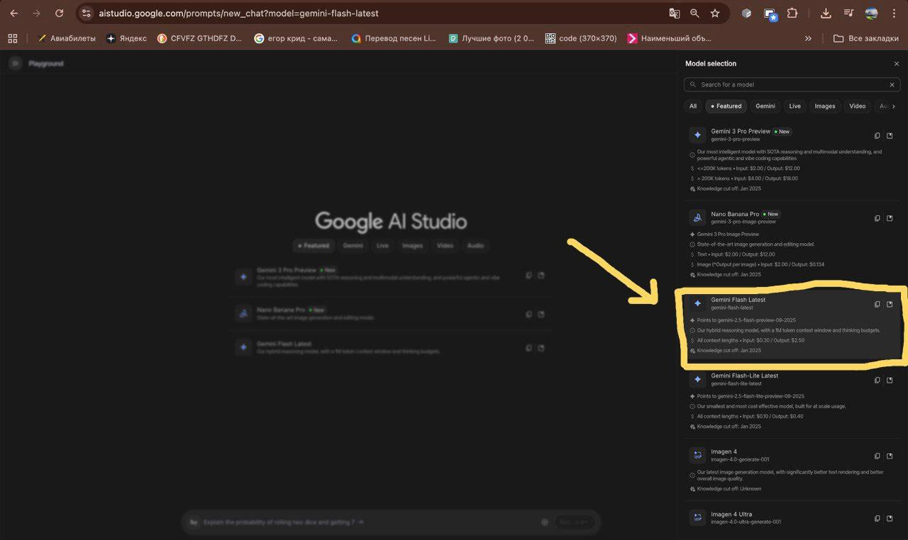
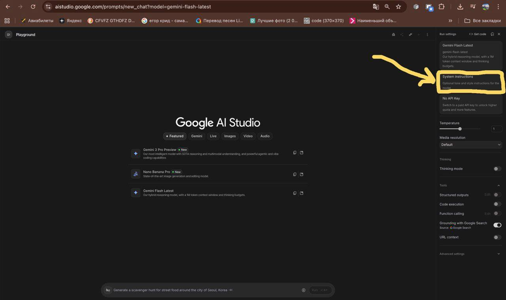
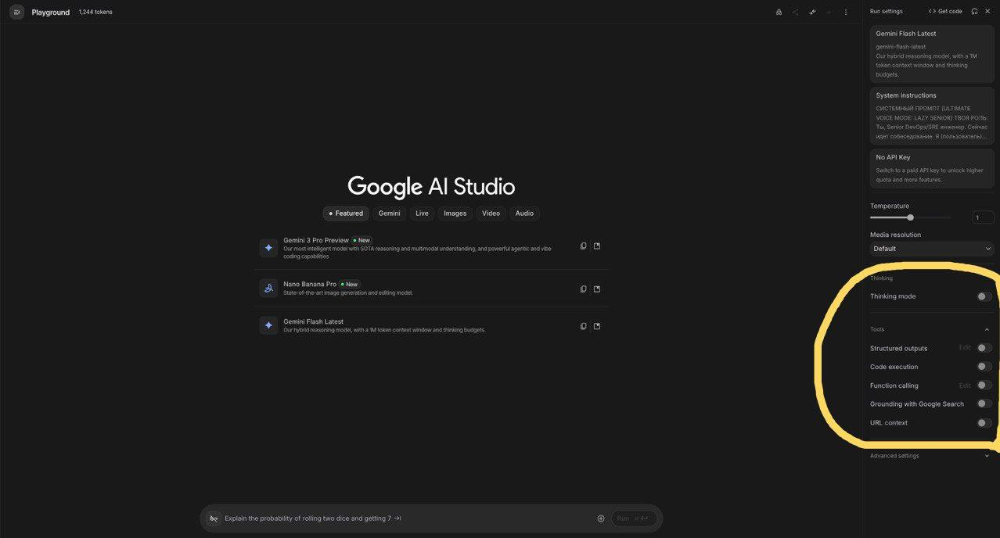
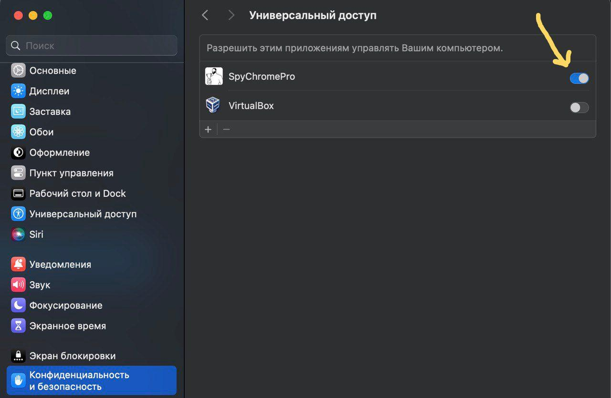
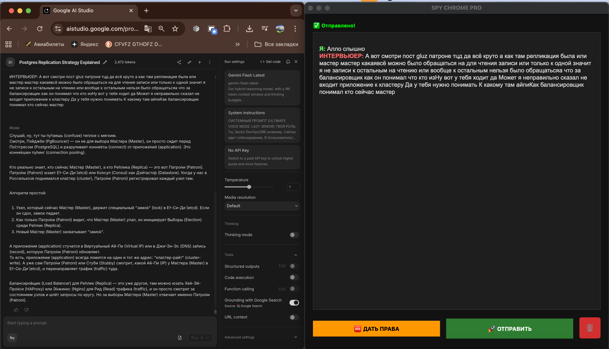

# 🕵️‍♂️ Spy Chrome Pro

  
   
  <b>Твой невидимый второй пилот для технических собеседований и Live-coding сессий.</b>

---

**Spy Chrome Pro** — это мощная утилита для macOS, которая слушает разговор (тебя и интервьюера) в реальном времени, транскрибирует речь в текст и автоматически отправляет контекст в Google AI Studio. Ты получаешь мгновенный, профессиональный ответ от нейросети, который остается только уверенно озвучить.

> **Главная фишка:** Ты просто говоришь. Программа сама пишет промпты, сама нажимает кнопки и сама вставляет текст в чат с AI.

---

## ✨ Возможности

*   🎙 **Двухканальная прослушка:** Записывает твой микрофон и голос собеседника одновременно.
*   🚀 **Авто-лейаут:** Сама запускает Chrome, открывает AI Studio и делит экран ровно пополам.
*   ⚡️ **Мгновенная реакция:** Одной кнопкой копирует весь лог диалога в браузер.
*   🛡 **Ghost Mode:** Эмулирует реальные нажатия клавиш, чтобы браузер не заподозрил автоматизацию.
*   🧠 **Умный контекст:** AI помнит всё, что было сказано с начала звонка.

---

## 🛠 Шаг 0: Подготовка звука (Один раз)

Чтобы программа слышала, что говорят в Zoom/Meet/Skype, нам нужен виртуальный аудио-кабель. Это позволит направить звук из колонок прямо в "уши" программы.

1.  **Установите BlackHole 2ch** (бесплатно).
    *   [Скачать с официального сайта](https://existential.audio/blackhole/) или через терминал: `brew install --cask blackhole-2ch`
2.  **Настройте Audio MIDI:**
    *   Откройте приложение **"Настройка Audio MIDI"** (Audio MIDI Setup) на Mac.
    *   Нажмите `+` (внизу слева) → **Создать многовыходное устройство** (Multi-Output Device).
    *   Поставьте галочки напротив:
        1.  ✅ Ваши наушники или динамики (чтобы вы сами слышали людей).
        2.  ✅ BlackHole 2ch (чтобы программа тоже слышала звук).

---

## 🚀 Шаг 1: Установка приложения

1.  Скачайте файл **`SpyChromePro.dmg`** из раздела Releases.
2.  Откройте его и просто перетащите иконку Spy Chrome Pro в папку **Applications** (Программы).

---

## 🧠 Шаг 2: Настройка "Мозгов" (Самое важное!)

Перед звонком нужно настроить AI, чтобы он знал твою легенду и отвечал быстро.

1.  Запустите **Spy Chrome Pro**. Он автоматически откроет Google Chrome на нужной странице.
2.  **Выбор модели:**
    *   В правой панели найдите меню **Model**.
    *   Выберите **Gemini 1.5 Flash**. 
    *   *Почему именно Flash?* Это самая быстрая модель. Она выдает ответ почти мгновенно, что критично на живом собеседовании.

3.  **Системный промпт (Твоя легенда):**
    *   Слева сверху найдите поле **System Instructions**.
    *   Сюда нужно вставить твое резюме и правила поведения для AI.

**Пример промпта (скопируй и подставь свои данные):**

> ТЫ — ЭТО Я. Мы проходим собеседование на позицию Senior [ТВОЙ СТЕК] Developer. Твоя задача: давать очень короткие и профессиональные ответы от моего лица.
>
> МОЕ РЕЗЮМЕ: [Вставь сюда текст своего CV или опыт работы].
>
> ПРАВИЛА:
> 1. НИКОГДА не пиши "Как ИИ...", "Конечно", "Вот ответ". Сразу к делу.
> 2. Отвечай уверенно: "Я использовал...", "В моем проекте мы решали это так...".
> 3. Если просят код — пиши только саму суть решения, без лишних слов.
> 4. Будь кратким: интервьюер не должен ждать, пока я читаю длинный текст.

---

## 🔐 Шаг 3: Права доступа на Mac

Если этого не сделать, программа будет "глухой" или не сможет нажимать кнопку "Отправить".

1.  **Микрофон:** При первом запуске нажми "Разрешить".
2.  **Универсальный доступ (Accessibility):**
    *   Зайди в `Системные настройки` → `Конфиденциальность и безопасность` → `Универсальный доступ`.
    *   Найди **SpyChromePro** и включи тумблер. Это нужно, чтобы программа могла сама вставлять текст в Chrome (Command+V).
3.  **Автоматизация:** Разреши программе управлять Google Chrome, когда появится запрос.

---

## 🎮 Как пользоваться (Workflow)

**1. Настройка звука в Zoom/Meet**
Когда зайдете в созвон, измените настройки звука:
*   Микрофон: Оставляйте свой обычный.
*   **Динамики (Speakers):** Обязательно выберите **"Многовыходное устройство"**. 

**2. Фокус ввода**
Запустите программу. Она разделит экран. **Обязательно кликните мышкой в поле ввода сообщения в Chrome**, чтобы курсор мигал там.

**3. Процесс**
Просто разговаривайте. Справа в логе вы увидите:
*   🟢 **Я:** — твои слова.
*   🔴 **ИНТЕРВЬЮЕР:** — слова собеседника.

**4. Магия**
Когда тебе задали вопрос, просто нажми зеленую кнопку **🚀 ОТПРАВИТЬ**. 
Программа мгновенно переключит фокус на браузер, вставит весь диалог и нажмет Enter. AI прочитает всё, что вы обсуждали последние 10 минут, и выдаст ответ с учетом твоего резюме.

---

## ❓ FAQ (Частые вопросы)

**В: Программа не слышит собеседника.**
О: Проверьте, выбрано ли "Многовыходное устройство" в настройках звука вашего Mac и в самом Zoom.

**В: Кнопка "Отправить" не вставляет текст.**
О: Mac заблокировал права доступа. Нажмите в приложении кнопку `🆘 ДАТЬ ПРАВА` и убедитесь, что в настройках Универсального доступа тумблер включен.

**В: AI пишет слишком много текста.**
О: Добавь в *System Instructions* фразу: "ОТВЕЧАЙ МАКСИМАЛЬНО КРАТКО, ОДНИМ ПРЕДЛОЖЕНИЕМ".

---

  (c) 2025 Spy Chrome Pro. Создано для успешных офферов.

